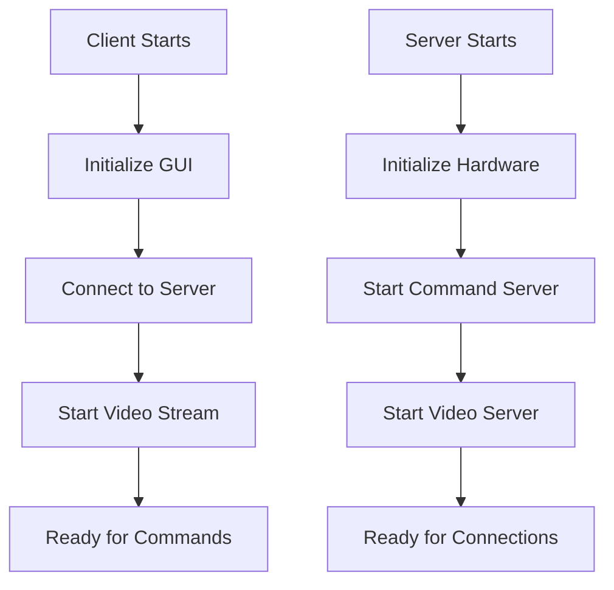
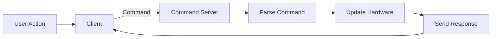
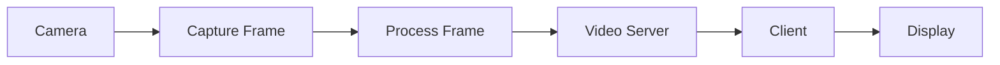

# Freenove Tank Robot Kit - Codebase Workflow

## Table of Contents
1. [System Architecture](#system-architecture)
2. [Component Interaction](#component-interaction)
3. [Control Flow](#control-flow)
4. [Data Flow](#data-flow)
5. [Thread Management](#thread-management)
6. [Error Handling](#error-handling)
7. [Extension Points](#extension-points)

## System Architecture

The codebase follows a client-server architecture with the following main components:

```
+------------------+       +------------------+
|   Client (PC)    | <---> |  Server (RPi)   |
+------------------+       +------------------+
| - GUI            |       | - Command Server |
| - User Input     |       | - Video Server   |
| - Video Display  |       | - Hardware Control|
+------------------+       +------------------+
```

## Component Interaction

### Client-Side Components
- **Main Window (Main.py)**: Handles the GUI and user interactions
- **Video Streaming**: Manages video feed from the robot
- **Command Sender**: Sends control commands to the robot
- **Status Monitor**: Displays sensor data and robot status

### Server-Side Components
- **Command Server**: Processes incoming control commands
- **Video Server**: Handles video streaming to the client
- **Hardware Controller**: Manages motors, sensors, and actuators
- **Camera Module**: Captures and processes video feed

## Control Flow

### 1. Initialization


### 2. Command Processing


### 3. Video Streaming


## Data Flow

### Command Format
Commands follow this structure:
```
CMD_TYPE#PARAM1#PARAM2#...#PARAMN\n
Example: CMD_MOTOR#1000#1000\n
- CMD_MOTOR: Motor control command
- 1000: Left motor speed
- 1000: Right motor speed
```

### Response Format
Responses follow a similar structure:
```
RESPONSE_TYPE#STATUS#DATA\n
Example: CMD_SONIC#OK#25.5\n
- CMD_SONIC: Response to ultrasonic command
- OK: Status
- 25.5: Distance in cm
```

## Thread Management

The system uses multiple threads for concurrent operations:

1. **Main Thread**: Handles GUI updates and user input
2. **Command Thread**: Processes incoming commands
3. **Video Thread**: Handles video streaming
4. **Sensor Thread**: Monitors sensors and updates status

## Error Handling

### Common Error Scenarios
1. **Connection Loss**: Automatic reconnection attempts
2. **Command Timeout**: Commands have a timeout period
3. **Hardware Failures**: Graceful degradation when possible
4. **Video Stream Issues**: Auto-restart of video stream

## Extension Points

### Adding New Commands
1. Define command in `Command.py`
2. Add handler in server command processor
3. Update client to send new command
4. Add any necessary GUI controls

### Adding New Sensors
1. Connect sensor to RPi
2. Create sensor driver class
3. Add to hardware controller
4. Update command set if needed
5. Add status display in client

### Custom Behaviors
1. Modify the appropriate controller class
2. Add new command handlers
3. Update client interface
4. Test thoroughly with hardware

## Conclusion

This workflow overview provides a high-level understanding of how the Freenove Tank Robot Kit codebase operates. The system is designed to be modular, making it relatively straightforward to extend or modify its behavior. The client-server architecture separates the control interface from the hardware, allowing for flexible deployment options.
